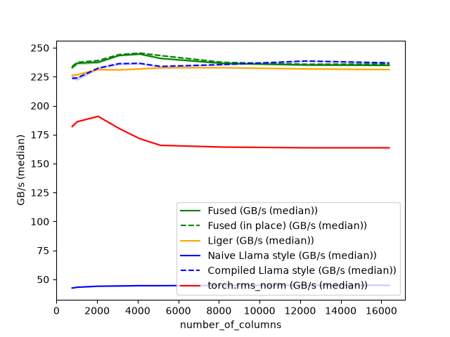
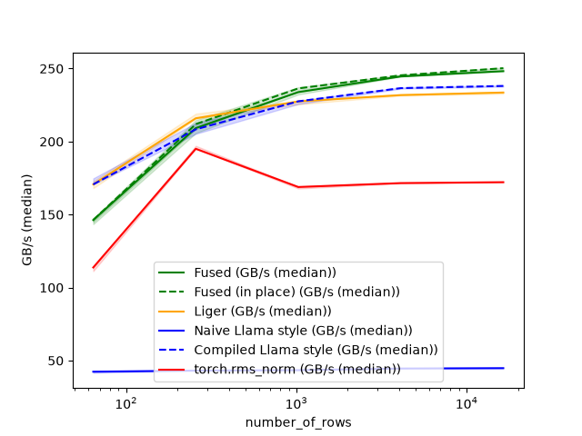

# Fused RMSNorm and Residual Add in Triton

A Triton GPU kernel project that fuses the residual-add and RMSNorm 
steps used at every transformer layer boundary into a single memory pass.

## Writeup on what the optimizations did

The kernel reads two arrays and writes two arrays. Nothing it computes is particularly expensive, so the time it takes
is almost entirely the time the GPU spends moving the data. This whole exercise was looking for anything that stops the
memory system from running optimally. This project was done testing with NVIDIA Tesla T4 GPUs, which run at about
~320 GB per second, and the idea was to get as close to that as possible.

Each optimization is in its own commit, with the benchmark run before and after.

Here is where the kernel ends up as, measured on a T4 in fp16.

Higher is better, and the numbers are effective bandwidth, meaning the bytes the operation has to move (logically)
divided by the time it took. Every implementation is credited with the same byte count, so a fused kernel that makes
fewer passes over memory shows up as a higher number for the same work. A T4 tops out around 320 GB per second.

The second sweep fixes the row width and varies how many rows there are. The curve climbing on the left is the GPU not
being full yet, where the time is mostly the cost of starting the kernel rather than moving data. Once there is enough
work to go around, everything flattens out against the memory ceiling.

### 1. Letting Triton pick the warp count
_Implementation SHA `d72ba3e4eb1f8faae330c839926188e02212998e`_
_Results SHA `15dcd7c1600756a94fe0d192a81916f9e8ced6bf`_

A Triton kernel runs as a grid of small programs, and each program is made of warps, which are groups of 32 threads that
execute together. We choose how many warps a program uses. With more warps, the work of one row is split across more
threads, and each thread handles fewer values. Too few and each thread is overloaded. Too many and there is not enough
to do for each.

The original iteration of the code guessed with a hardcoded rule of thumb based on row width. The implementation that
applies this optimization replaced the guess with `triton.autotune`, which compiles several warp counts, times them on
the real inputs, and caches the winner for each combination of row width and data type.

The following are the speedups for bf16, with speedup being old time divided by new time, so above 1 means the new
iteration is faster than the last.

| Row width (4096 rows) | Speedup | Rows (width 4096) | Speedup |
|-----------------------|---------|-------------------|---------|
| 768                   | 0.99    | 64                | 0.86    |
| 1024                  | 1.04    | 256               | 0.96    |
| 2048                  | 1.04    | 1024              | 1.03    |
| 4096                  | 1.07    | 4096              | 1.07    |
| 8192                  | 1.02    | 16384             | 1.07    |
| 16384                 | 1.03    |                   |         |

At 4096 by 4096 in bf16 the kernel went from 228 to 243 GB per second, which is about 76 percent of what the GPU can do.
Before this change it was tied with Liger's implementation. After it, it is ahead by about 5 percent.

The four other implementations in the benchmark did not change between the two runs, and their numbers moved by less
than 1 percent, so the gains above are not due to the Colab machine somehow performing differently.

The one bad result is the 64 row case, which got about 15 percent slower and stayed slower in later bf16 runs. With only
64 rows the GPU is barely busy and the measurement is dominated by the cost of starting the kernel (too much overhead).
The tuner also picks its warp count while measuring a much larger input, then reuses it here, so the choice is tuned for
a situation that does not apply. It could be any of the two.

### 2. Having each program handle several rows
_Implementation SHA `4c35361e0fe598ad365e47b88ff58628af604d4a`_
_Results SHA `7f7ca5e9d4c5c3a3d5b2a9be3bd8c62f10b8a882`_

Until now, the kernel launched one program per row. That is a lot of programs for 16384 rows, each doing very little.
The new idea is to launch a fixed number of programs, sized to the GPU, and have each one loop over many rows. This
saves startup cost and lets the weight vector be loaded once per program instead of once per row (reducing some
overhead).

This new iteration (applying this optimization) was done with autotune, and the variable tuned was the number of
programs per streaming multiprocessor. Zero results in the old behaviour, meaning one per row.

It mostly decided against it. In 27 combinations of row width and data type, it picked the new version only 4 times, and
in those cases the difference could be considered noise resulting from re-running a fixed implementation. The before and
after medians were within 1 percent of each other across every configuration.

In hindsight, it made sense. The T4 cannot move data fast enough to keep up either way, and flooding the GPU with many
small programs keeps the memory system busy. The loop was kept anyway, since it costs nothing when the tuner selects
zero, and newer GPUs may benefit from it.

### 3. Checking that loads and stores are wide
_Notebook SHA `a2f216aa0b1d439a03de764abc10702f746b2f93`_

#### On one hand

A thread does not have to fetch one value at a time. There are instructions that grab 16 bytes at once using something
like CUDA's vector types. This is very useful on this kernel since fewer and wider movements transfer the same data with
less overhead. Triton uses them on its own, but only when it knows the addresses line up properly and each thread has
enough neighbour values to completely fill one.

When dumping the generated machine code and counted the memory instructions, there were no narrow 2 byte accesses
anywhere, meaning no alignment bugs.

The surprising part is that the width depends on the warp count, because both are determined by the number of values
each thread has. Eight bf16 values fill 16 bytes, so a thread needs at least eight of them. At 4096 columns in bf16 the
tuner picked 32 warps, which leaves only 4 values per thread, and the generated code falls back to 8 byte transfers,
which means the tuner preferred the narrow version over the wide one.

#### On the other hand

Dropping the warp count to widen the transfers does not work either. Here is what the compiler produced at 16384 wide in
bf16, where spill bytes is how much each thread had to shove out to memory because it ran out of registers.

| Warps | Values per thread | Registers | Spill bytes |
|-------|-------------------|-----------|-------------|
| 1     | 512               | 168       | 1176        |
| 2     | 256               | 72        | 530         |
| 4     | 128               | 255       | 0           |
| 8     | 64                | 128       | 0           |
| 16    | 32                | 64        | 4           |
| 32    | 16                | 57        | 0           |

This kernel's purpose is to avoid memory access, so spilling defeats the point and the first two rows are useless. The 4
warp row looks great, but 255 registers is the maximum for the T4, so it avoided spilling only by grabbing every
register available. This leaves no room to run other warps alongside it. So 8 warps is the lowest count that is usable
here, and the vector width limit from the previous section is the ceiling, since going higher shrinks each thread's
share until the wide transfers are no longer possible.

### 4. Writing the result over the input
_Implementation SHA `8556ea7afc66559982dfc2796e4f218a491a2447`_
_Results SHA `9b9d68b458fa622eb5e5f19ccc91b37f1f0e8095`_

Real models reuse the residual buffer rather than allocating a new one, so the kernel supports pointing the output at
the same memory as the input (in place implementation). The worry was that this came at a cost. Measured across 42
configurations and two separate sessions, the in place version is within 0.1% to the other one, so no problem.

However, the autotuning did break something. While the tuner is timing candidate configurations it runs the kernel
many times on the real input, and with the output aliased onto the input every one of those runs corrupts it more each
time. It was fixed with one argument telling Triton to snapshot and restore that buffer during tuning. The existing in
place test did not catch this, because by then the tuning cache was already warm from earlier tests and the kernel ran
only once. The bug only appears on the first call for some row width and data type, so it was only caught when
running a test that clears the tuning cache and forces the tuning to happen on the aliased buffer.

## Setup

1. Install Docker Desktop or restart it if it is already installed
2. Add execution permissions to the pre-commit hook with `chmod +x .github/hooks/*`.
3. Add the version-controlled hooks directory as a hooks path for the local git command with `git config core.hooksPath .github/hooks`.
4. Install Task: `brew install go-task`
5. Build the image and set up the requirements: `task setup` (first run takes a while)
6. Check that the smoke test runs green: `task test` 
7. Check that you can Bash inside the container: `task shell`

## Commands

| Command                    | Where it runs     | What it does                                                                              |
|----------------------------|-------------------|-------------------------------------------------------------------------------------------|
| `task`                     | Local             | List all tasks                                                                            |
| `task setup`               | Local + container | First-time install (build image, resolve lock, install CPU dependencies)                  |
| `task build`               | Local             | Rebuild the Docker image (only needed after editing the Dockerfile)                       |
| `task lock`                | Container         | Resolve dependency versions into `uv.lock`                                                |
| `task sync`                | Container         | Install dependencies from `uv.lock` into the virtual environment volume (CPU torch)       |
| `task add -- <pkg>`        | Container         | Add a dependency to `pyproject.toml`, then re-lock and re-sync                            |
| `task shell`               | Container         | Open an interactive bash session                                                          |
| `task py`                  | Container         | Open a Python REPL with the project installed                                             |
| `task lint`                | Container         | Run ruff check and ruff format in check mode, reports problems without changing files     |
| `task fmt`                 | Container         | Run ruff with autofix and reformat files in place                                         |
| `task test`                | Container         | Run the CPU test suite under `TRITON_INTERPRET=1` (same command as CI)                    |
| `task check`               | Container         | Run lint then test (same command as the pre-commit hook)                                  |
| `task gpu:sync`            | GPU host          | Installs CUDA torch plus bench extras. Run natively on Colab or a GPU box, not via Docker |
| `task gpu:test`            | GPU host          | Run the full test matrix including gpu-marked tests                                       |
| `task gpu:bench`           | GPU host          | Run the benchmark for the main operation                                                  |
| `task gpu:bench:tutorials` | GPU host          | Run the benchmark for the tutorials                                                       |
| `task clean`               | Local             | Remove containers and venv/cache volumes (full reset)                                     |

## Notes

When simulating, keep test shapes small. At most 16 x 4096 (token count M <= 16, hidden size N <= 4096).
The simulation interpreter runs one Python iteration per row, so a large token count will make tests slow.
